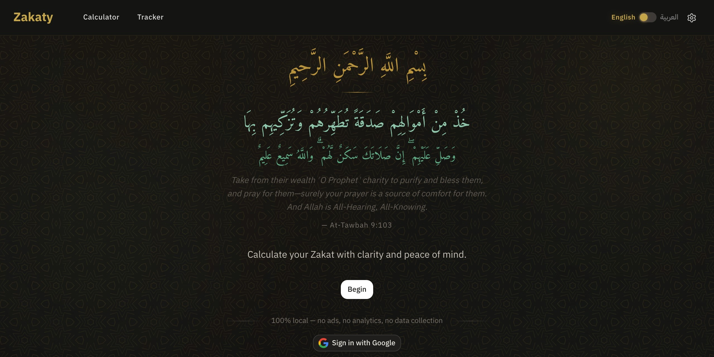

# Zakat App



A bilingual (Arabic/English) web app to calculate Zakat and track payments — with optional Google Drive sync.

**[Live App](https://abd3lraouf.github.io/zakat/)** | **[Setup Guide](docs/SETUP.md)**

---

## Features

- **Zakat Calculator** — Full Nisab calculation (gold & silver), all asset types, real-time breakdown
- **Payment Tracker** — Log payments with categories for all 8 Quranic recipients
- **Google Drive Sync** — Optional cross-device sync via Drive AppData (button-triggered, no auto-popups)
- **Bilingual** — Arabic (RTL) + English (LTR), auto-detected from browser locale
- **Dark Mode** — Respects `prefers-color-scheme`
- **Mobile-first** — Responsive from 320px to 1440px with bottom navigation
- **Private** — All data in localStorage; Drive sync only if user explicitly signs in
- **Import / Export** — JSON backup and restore
- **Accessible** — WCAG AA contrast, 44px touch targets, keyboard navigation

---

## Quick Start

```bash
git clone https://github.com/abd3lraouf/zakat.git
cd zakat
bun install
bun run dev
# Open http://localhost:3000
```

Requires [Bun](https://bun.sh). To deploy your own instance or enable Google Drive sync, see the **[Setup Guide](docs/SETUP.md)**.

---

## Tech Stack

| Layer | Technology |
|-------|------------|
| Framework | Nuxt 4 (SPA mode) |
| UI | Vue 3 Composition API, TypeScript |
| Styling | Tailwind CSS v4 (`@tailwindcss/vite`) |
| State | Pinia + `pinia-plugin-persistedstate` (localStorage) |
| i18n | `@nuxtjs/i18n` (Arabic + English, RTL/LTR) |
| Auth | Google Identity Services (OAuth2 token client) |
| Sync | Google Drive API v3 (AppData folder) |
| Testing | Vitest + happy-dom |
| Deploy | GitHub Pages via GitHub Actions |
| Package Manager | Bun |

---

## Project Structure

```
zakat/
├── app/
│   ├── app.vue                     # Root component
│   ├── app.config.ts               # Google Client ID, Drive settings
│   ├── assets/css/
│   │   ├── main.css                # Tailwind v4 entry + design tokens
│   │   └── base.css                # Base styles, typography, patterns
│   ├── components/                 # Vue components
│   ├── composables/                # Shared composables
│   ├── layouts/                    # Page layouts
│   ├── pages/                      # File-based routing (4 pages)
│   ├── plugins/                    # Nuxt plugins
│   ├── types/                      # TypeScript declarations
│   └── utils/                      # Constants, formatters
├── stores/                         # Pinia stores (auth, calculator, tracker)
├── shared/types/                   # Shared TypeScript types
├── locales/                        # i18n translations (en.json, ar.json)
├── tests/unit/                     # Vitest unit tests
├── nuxt.config.ts                  # Nuxt configuration
├── vitest.config.ts                # Vitest configuration
└── .github/workflows/              # CI + deploy workflows
```

---

## Zakat Calculation

| | Threshold |
|---|---|
| Gold Nisab | 85g of 24K gold |
| Silver Nisab | 595g of silver |

The app uses the **lower** of the two (conservative approach).

```
Net Zakatable Wealth = Gross Assets - Deductions
Zakat Due = Net Wealth × 2.5%   (only if ≥ Nisab)
```

---

## Development

```bash
bun install             # Install dependencies
bun run dev             # Dev server at http://localhost:3000
bun run test            # Run all tests
bun run test:watch      # Watch mode
bun run build           # Production build
bun run preview         # Preview production build
```

---

## License

[MIT](LICENSE)

---

*May Allah accept your Zakat*